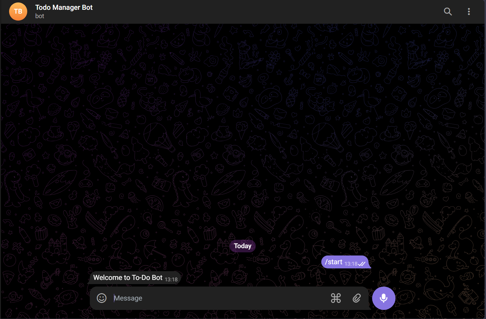
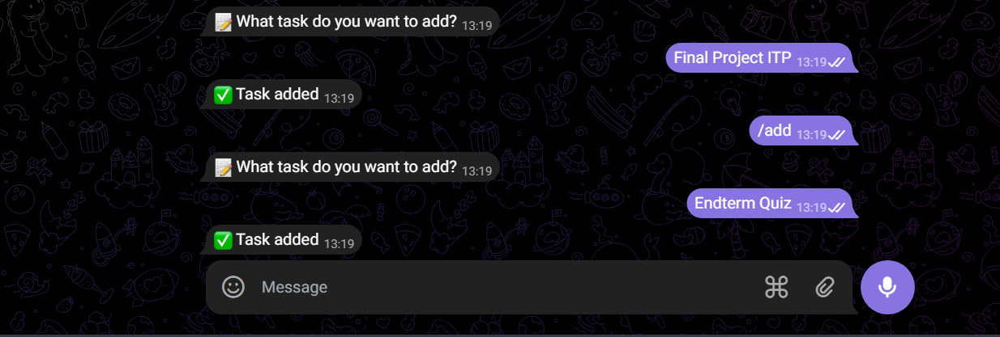
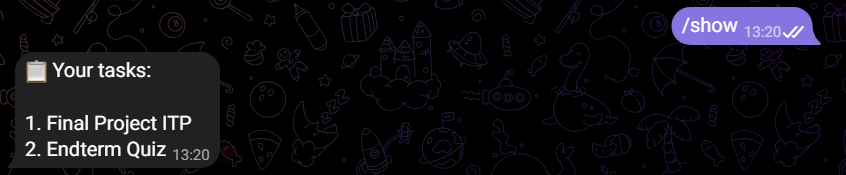
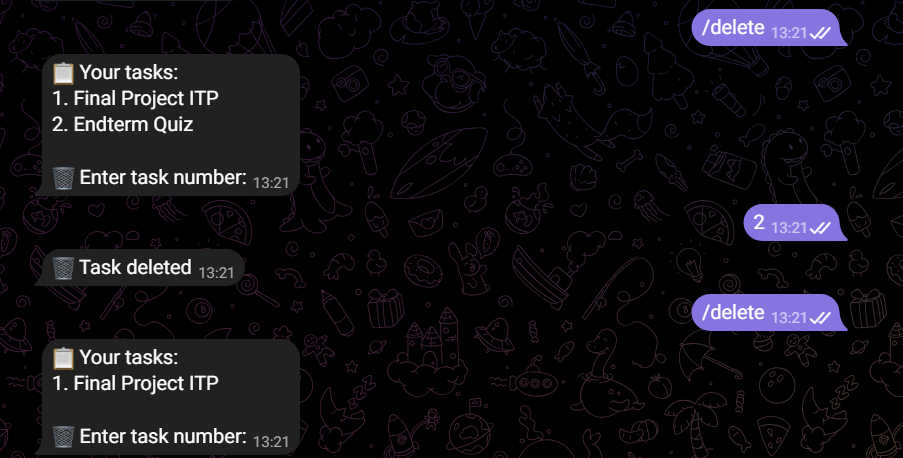
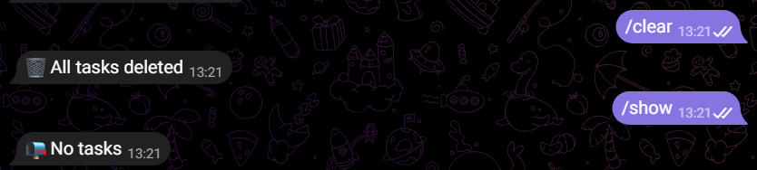

# Telegram To-Do Bot

## Project Description

Telegram To-Do Bot is a simple task management bot developed using Python and aiogram.

The bot allows users to create, manage, view, and delete personal tasks directly inside Telegram.

The project was created as a university assignment to practice:

- Object-Oriented Programming (OOP)
- Telegram Bot API
- JSON file handling
- Exception handling
- Python asynchronous programming
- CRUD operations

---

## Features

The bot supports:

- Add new tasks
- Show saved tasks
- Delete selected tasks
- Clear all tasks
- Store data in JSON format
- Telegram reply keyboard support
- Error handling
- OOP structure using `TaskManager` class
- CRUD operations
- FSM states for easier interaction

---

## Technologies Used

- Python 3
- aiogram
- JSON
- Telegram Bot API
- OOP principles

---

## Project Structure

```bash
todo_bot/
│
├── bot.py
├── config.py
├── data.json
├── handlers.py
├── keyboards.py
├── task_manager.py
├── requirements.txt
├── REPORT.md
├── screenshots/
│   ├── start.png
│   ├── add_task.png
│   ├── show.png
│   ├── delete_task.png
│   └── clear_tasks.png
└── README.md
```

---

## Installation

Install required libraries:

```bash
pip install -r requirements.txt
```

Run the bot:

```bash
python bot.py
```

---

## How to Use

Commands:

```text
/start
/add
/show
/delete
/clear
```

Examples:

```text
/add
Finish Python assignment

/show

/delete
1

/clear
```

---

## Screenshots

### Start menu



### Add task



### Show tasks



### Delete task



### Clear tasks



---

## Team Roles

Student 1:

- Backend logic
- TaskManager class
- JSON storage
- CRUD operations
- Telegram commands

Student 2:

- Interface improvements
- Documentation
- README and report

Student 3:

- Testing
- GitHub repository
- Project verification

---

## Conclusion

The project successfully implements a Telegram To-Do Bot with task management features.

The project demonstrates:

- Python programming
- aiogram framework
- OOP concepts
- JSON storage
- CRUD operations
- FSM state management
- Telegram Bot API integration